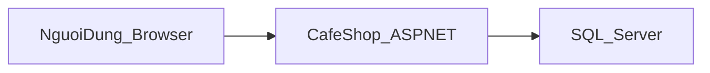
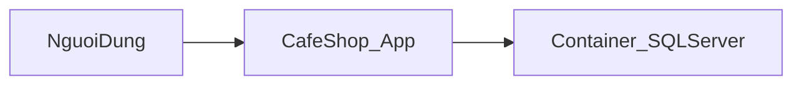

# Cài đặt và chạy bản thi hành (publish)

Thư mục `setup/publish/` chứa output của `dotnet publish` (Release, **framework-dependent**). Máy chạy cần cài **[.NET 8 ASP.NET Core Runtime](https://dotnet.microsoft.com/download/dotnet/8.0)** (hoặc .NET 8 Runtime đủ cho ứng dụng web tùy môi trường).

## Yêu cầu

- SQL Server (local hoặc Docker; xem `docker/compose.yaml` ở thư mục gốc repo).
- Chuỗi kết nối trong `appsettings.json` (trong `setup/publish/`) trỏ đúng tới SQL Server và database `CafeShopDb` (hoặc tên bạn đã tạo).

## Chạy nhanh

Từ thư mục `setup/publish/`:

```bash
dotnet ASPNET-DK24TTC6-LuuThiNgoc-CafeShop.dll
```

Ứng dụng lắng nghe theo cấu hình Kestrel (URL xem trong log khi khởi động). Có thể đặt `ASPNETCORE_URLS` nếu cần, ví dụ:

```bash
export ASPNETCORE_URLS=http://0.0.0.0:8080
dotnet ASPNET-DK24TTC6-LuuThiNgoc-CafeShop.dll
```

## Dữ liệu thử

- `setup/sample-data/script.sql`: bản sao script seed (roles, admin mặc định, dữ liệu mẫu). Ứng dụng khi chạy từ source cũng có thể tự chạy migration và script trong `Data/script.sql`; với bản publish, có thể thực thi script này trên database đã tạo nếu cần bổ sung dữ liệu (tùy trạng thái migration).
- Xuất **toàn bộ schema + dữ liệu** từ SQL Server đang chạy ra file `exported-database.sql`: xem [`sample-data/README.md`](sample-data/README.md) và chạy [`sample-data/export-db.sh`](sample-data/export-db.sh) (cần `curl`, `unzip`; lần đầu tải SqlPackage vào `sample-data/.tools/`).

## Tạo lại bản publish (từ source)

Tại thư mục gốc repo:

```bash
dotnet publish src/ASPNET-DK24TTC6-LuuThiNgoc-CafeShop/ASPNET-DK24TTC6-LuuThiNgoc-CafeShop.csproj -c Release -o setup/publish
```

### Bản self-contained (không cần cài .NET trên máy đích — dung lượng lớn hơn)

```bash
dotnet publish src/ASPNET-DK24TTC6-LuuThiNgoc-CafeShop/ASPNET-DK24TTC6-LuuThiNgoc-CafeShop.csproj -c Release -o setup/publish-self-contained -r win-x64 --self-contained true
```

Đổi `win-x64` thành `linux-x64` hoặc runtime phù hợp.

## Docker (image ứng dụng)

Build context phải là thư mục `src/` (chứa project). Từ thư mục gốc repo:

```bash
docker build -f docker/Dockerfile -t cafeshop-web:latest src
```

SQL Server có thể chạy riêng bằng `docker compose -f docker/compose.yaml up -d`; cấu hình connection string trong container phải trỏ tới host SQL (ví dụ `host.docker.internal` trên Docker Desktop) hoặc dùng network Docker chung.

## Sơ đồ triển khai tổng quát



Khi dùng Docker cho SQL:


